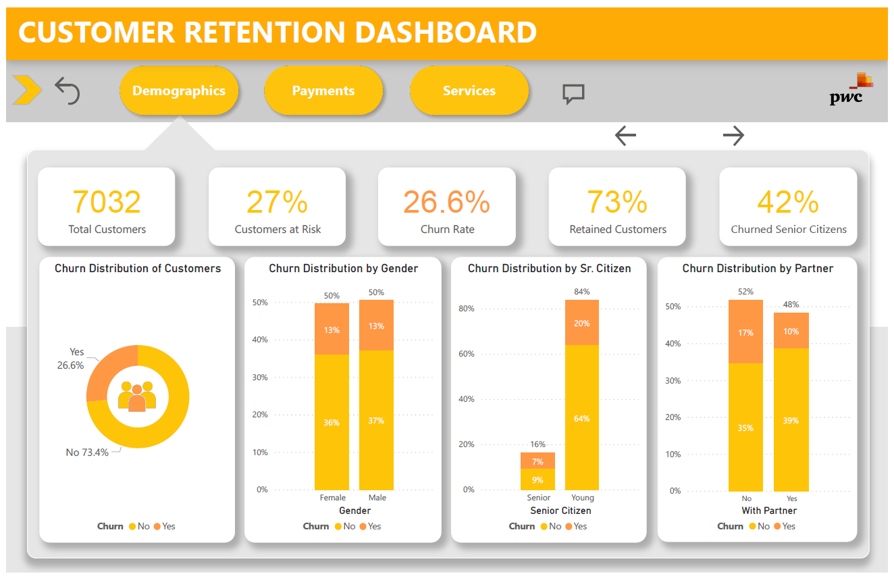
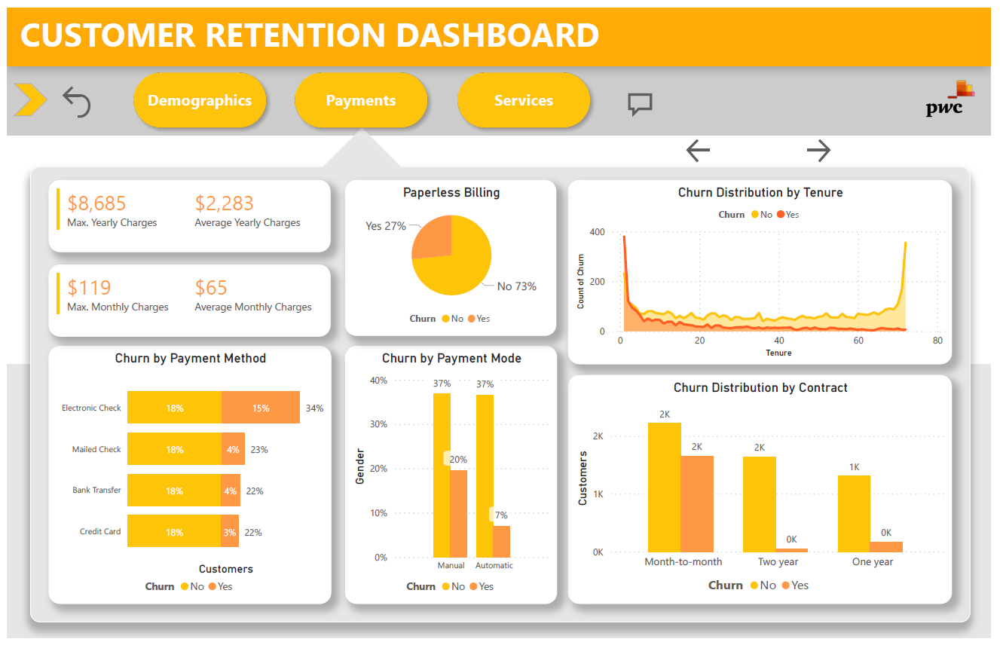
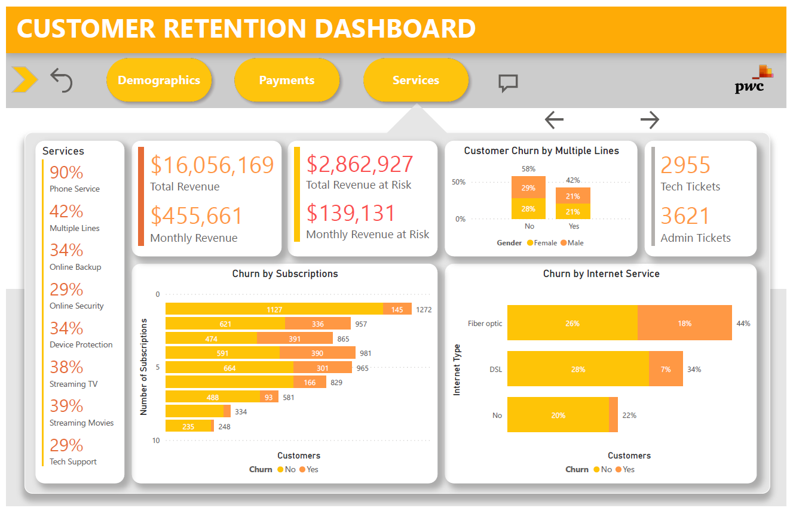
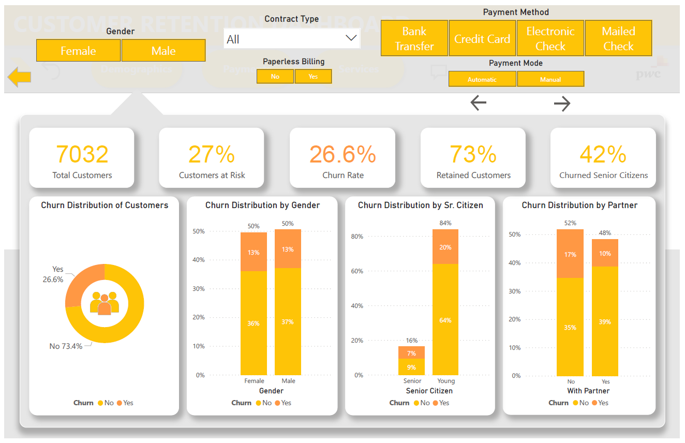
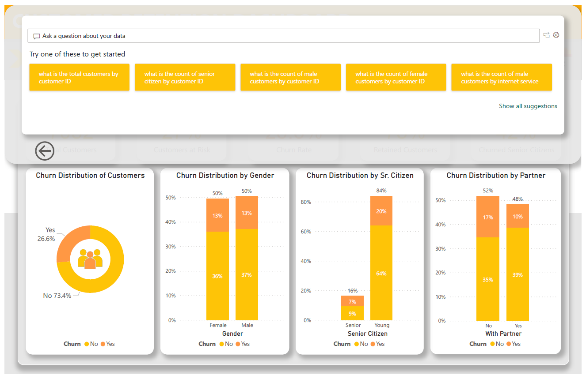

# Customer Churn Pattern Analysis &nbsp; 

## Description
As part of the PwC Power BI in Data Analytics Virtual Case Experience, I analyzed a customer churn dataset for a telecom client of PwC Switzerland. Through exploratory data analysis, I uncovered insights into the customer churn patterns, which I then visualized in a Power BI dashboard report. The report provided a clear and interactive way to communicate my findings, helping the client to better understand their customer behavior and make informed decisions to improve customer retention.

## Project Details

**What is Churn?** \
*Churn* refers to the rate at which customers stop doing business with a company or service, typically expressed as a percentage of the customer base. 

**What is a Churn Rate?** \
*Churn Rate*, sometimes known as attrition rate, is the rate at which customers stop doing business with a company over a given period of time. Churn may also apply to the number of subscribers who cancel or don’t renew a subscription. The higher your churn rate, the more customers stop buying from your business. The lower your churn rate, the more customers you retain. Typically, the lower your churn rate, the better.

**Churn Rate** = (Churned Customers / Total Number of Customers) x 100%

**What is Customer Churn?** \
*Customer Churn* refers to the natural business cycle of losing and acquiring customers. 
Every company — no matter the quality of its products or customer service experiences churn. In the context of businesses, customer churn can occur due to factors such as dissatisfaction with the product or service, competitive offerings, or changes in circumstances or preferences of the customer.
Generally speaking, the less churn a company has, the more customers they keep.

## Data Collection

The dataset was provided as an excel file by PwC from a telecom client during PwC Power BI in Data Analytics Virtual Case Experience, which contained 7000+ records of customer information consisting major fields like Gender, Senior Citizen, Tenure, Payment Method, Phone Service, Contract, Monthly Charge, Subscriptions, etc. \
**Link:** [Dataset](02-Churn-Dataset.xlsx)

## Skills
- Data Cleaning 
- Data Inspection 
- Data Transformation 
- Data Standardization 
- Data Visualization 

> **Data Inspection:** Visually inspecting the data to identify errors, inconsistencies, or missing values.

> **Data Transformation:** Converting data from one format or structure to another, in order to make it more   suitable for a specific task or analysis.

> **Data Standardization:** Converting data into a standard format, such as converting all text to lowercase or standardizing date formats.

## Tech Stack

- Microsoft Excel 
- Microsoft SQL Server
- Microsoft Power BI

## Observations

- Contract type is a key factor for churn.
- Month-to-month  customers are more likely to churn. 
- Senior citizens likely to churn.
- Out of the 56% month-to-month contract customers, 24% of them churned. 
- Female customers with a month-to-month contract are more likely to churn than male customers with a month-to-month contract.
- Only 1% of the customers with a two years contract churn.
- Male customers with one year contract are more likely to churn than female with one year contract.
- Male customers with two years contract are also more likely to churn than female with two years contract.
- As tenure increases, the number of churn customers decreases.
- Customers with manual payment mode are more likely to churn.
- Out of the 44% customers with fiber optic internet, 18% of them churned. 

## Dashboard

